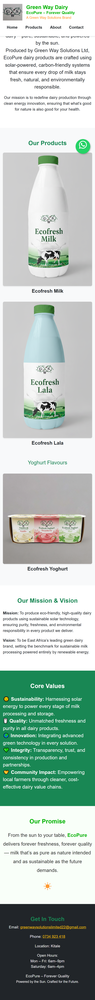

# 🥛 Green Way Dairy — EcoPure Website

**EcoPure – Forever Quality**  
*A Green Way Solutions Brand*

EcoPure represents a new generation of dairy — pure, sustainable, and powered by the sun.  
Produced by **Green Way Solutions Ltd**, EcoPure dairy products are crafted using solar-powered, carbon-friendly systems that ensure every drop of milk stays fresh, natural, and environmentally responsible.

---

## 🌞 Mission Statement
To produce eco-friendly, high-quality dairy products using sustainable solar technology, ensuring purity, freshness, and environmental responsibility in every product we deliver.

## 🌍 Vision Statement
To be East Africa’s leading green dairy brand, setting the benchmark for sustainable milk processing powered entirely by renewable energy.

---

## 💚 Core Values
- 🌞 **Sustainability:** We harness solar energy to power every stage of milk processing and storage.  
- 🥛 **Quality:** We guarantee unmatched freshness and purity in all our dairy products.  
- 🌍 **Innovation:** We integrate advanced green technology in every solution we offer.  
- 💚 **Integrity:** We uphold transparency, trust, and consistency in production and partnerships.  
- 🤝 **Community Impact:** We empower local farmers through cleaner, cost-effective dairy value chains.

---

## 🌿 Our Promise
> From the sun to your table, EcoPure delivers forever freshness, forever quality — milk that’s as pure as nature intended and as sustainable as the future demands.

---

## 📸 Website Screenshot
Below is a full-page preview of the website:

---

## 📫 Contact Information
**Email:** greenwaysolutionslimited22@gmail.com  
**Phone:** 0734 923 418  
**Location:** Kitale  
**Open Hours:**  
Mon–Fri: 6am–9pm  
Saturday: 6am–4pm  

---

## 🌐 Live Demo
👉 [View Website on Netlify](https://YOUR_SITE_NAME.netlify.app)

---

## 🛠️ Built With
- **HTML5**
- **CSS3**
- **Bootstrap 5**
- **JavaScript**

---

## 📄 License
© 2025 Green Way Solutions Ltd. All Rights Reserved.
